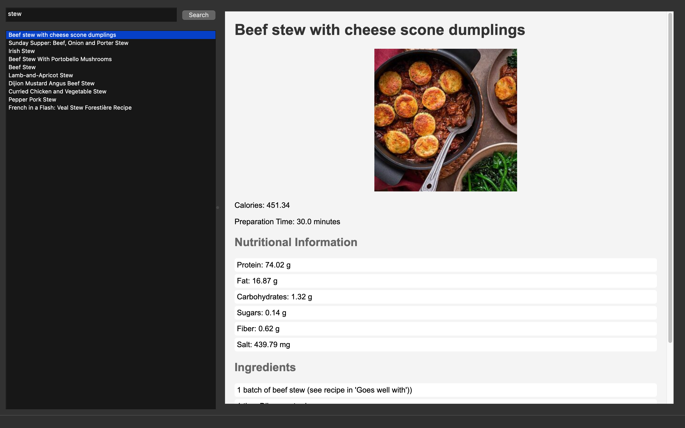
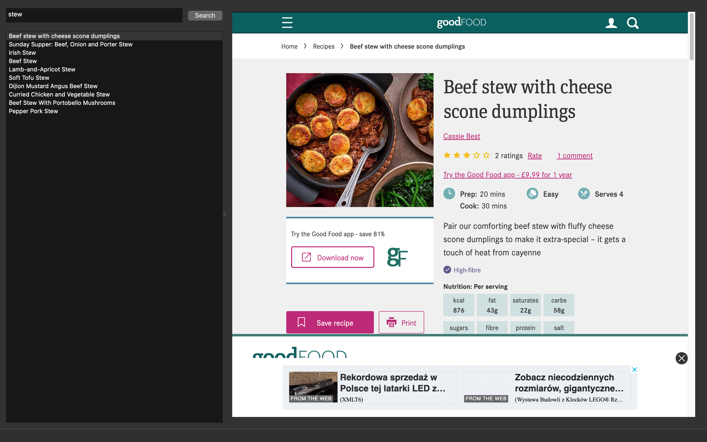
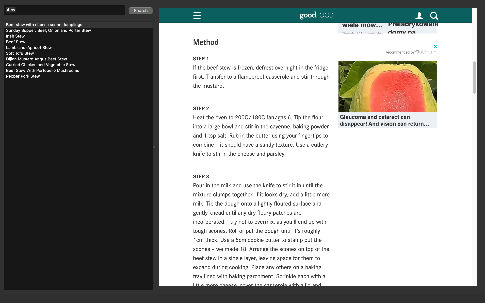

To install and use this app, please follow these instructions:

1. Ensure that you have Python installed on your system. You can check by running `python --version` in your terminal.

2. Clone the repository to your local machine using the command:
    ```
    git clone https://github.com/Kemo321/Culinary-Book
    ```

3. Navigate to the project directory:
    ```
    cd Culinary-Book
    ```

4. Install the required dependencies by running:
    ```
    pip install -r requirements.txt
    ```

5. Once the dependencies are installed, you can run the app using the following command:
    ```
    python main.py
    ```




